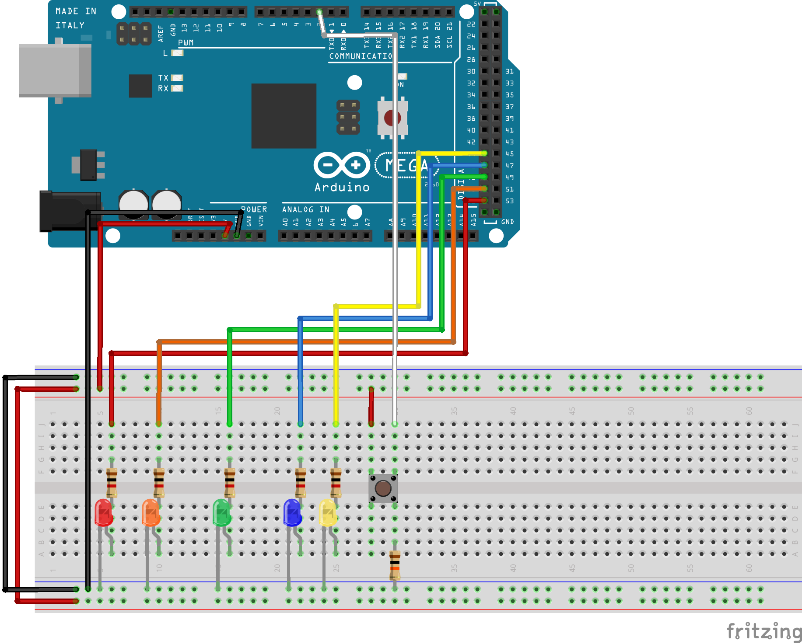
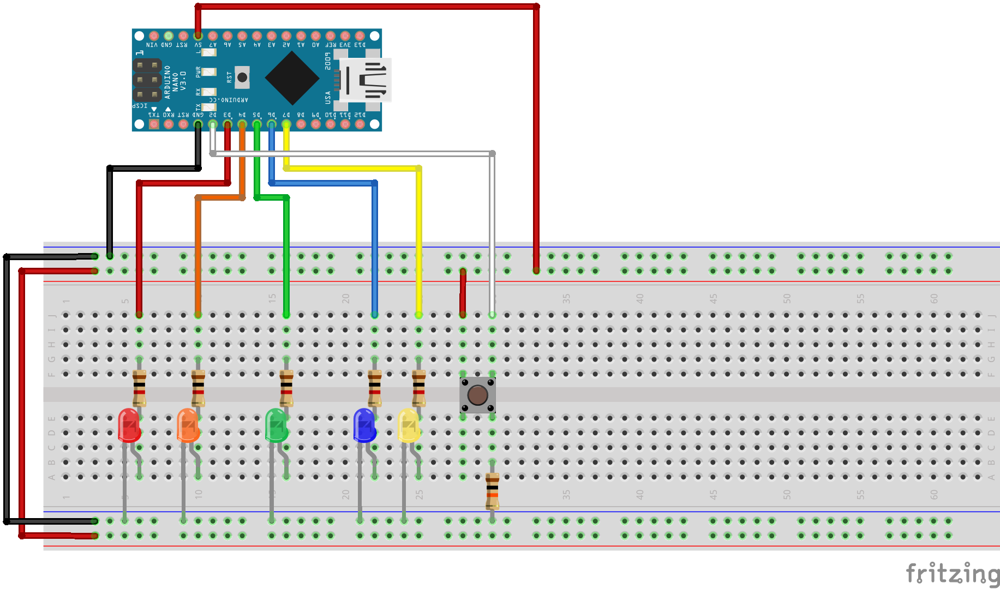

# A binary counter

The binary counter is an example of an Arduino project.

This project uses one button and five Leds that display numbers in the binary
form.

It has two modes of operation:

*  Intro mode.
*  Button press counting mode.

## The intro mode

The intro mode is a for loop repeatedly counting from zero to 31, always
displaying the current number in the binary format using the Leds.

The intro mode gets terminated when the button is pressed.

## The button press counting mode

This mode begins once the intro mode is terminated by a button press.

The user can press the button repeatedly. The binary counter will count the
number of presses. One count represents a press and a release of the button.

Once the user stops pressing the button, the number of times the accumulated
count will be displayed in binary form using the Leds.

## The circuit

### The breadboard

#### On Arduino Mega

The [Fritzing](http://fritzing.org) circuit is stored in file
[binary_counter.fzz](doc/binary_counter_mega.fzz).

#### On Arduino Nano

The [Fritzing](http://fritzing.org) circuit is stored in file
[binary_counter.fzz](doc/binary_counter_nano.fzz).
